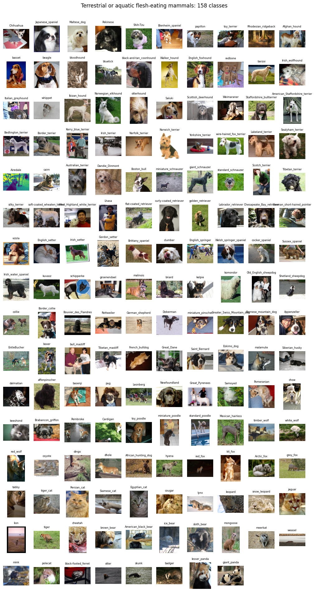
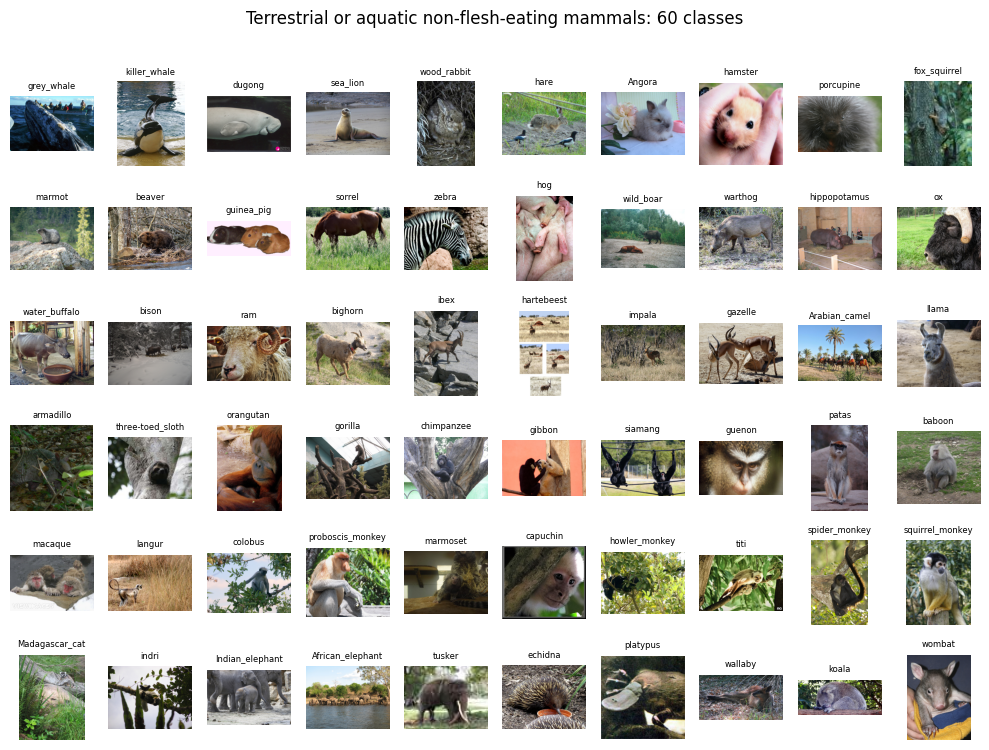
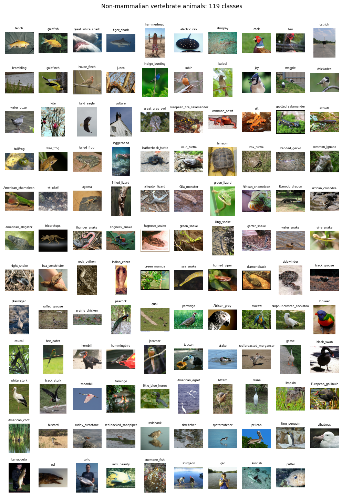
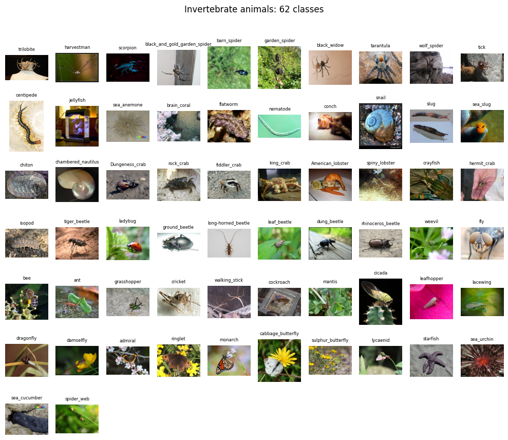
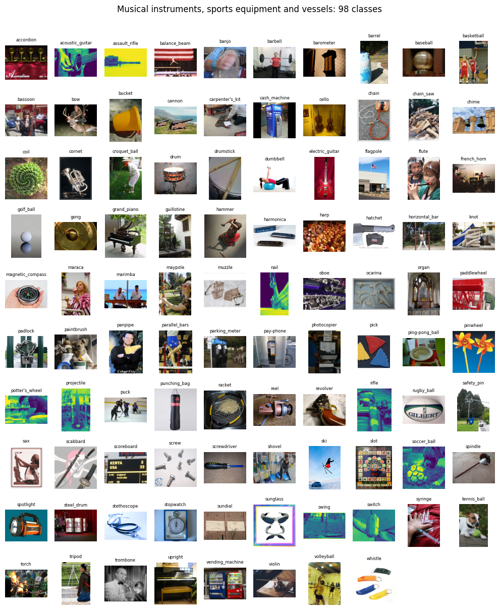
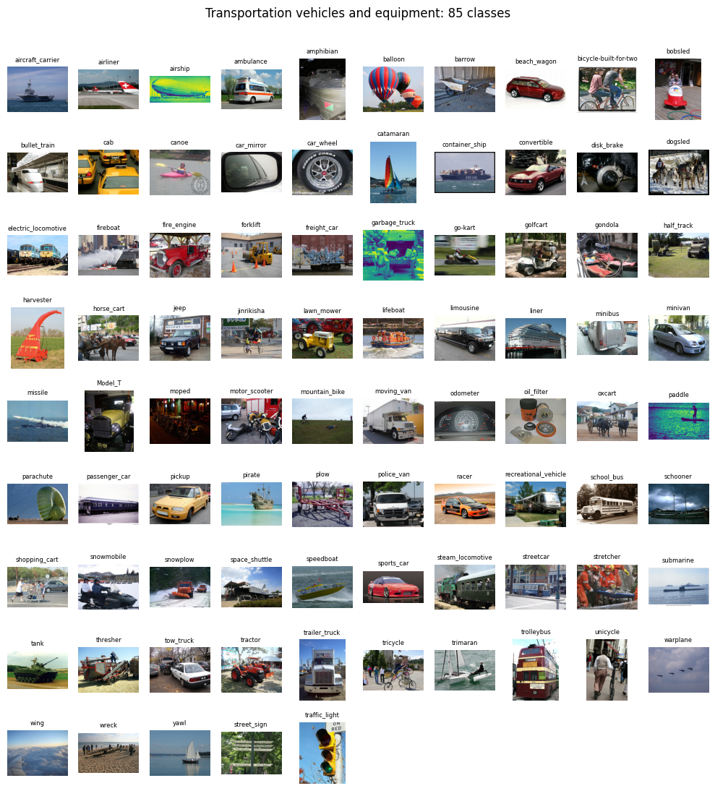
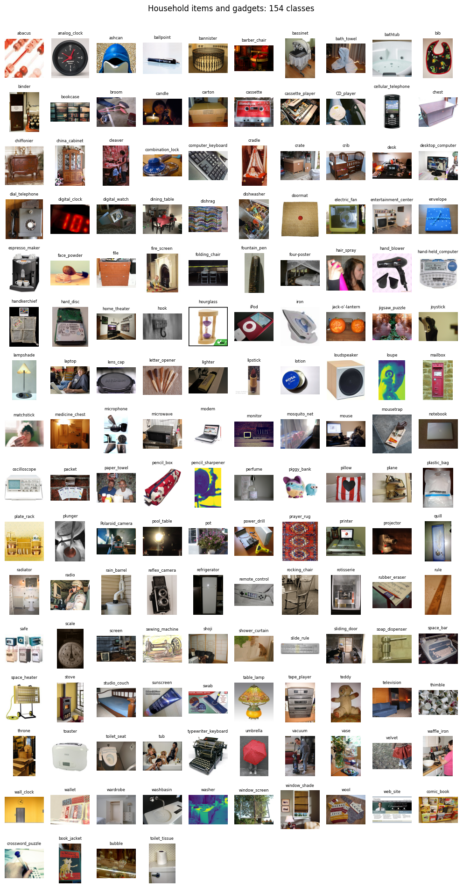
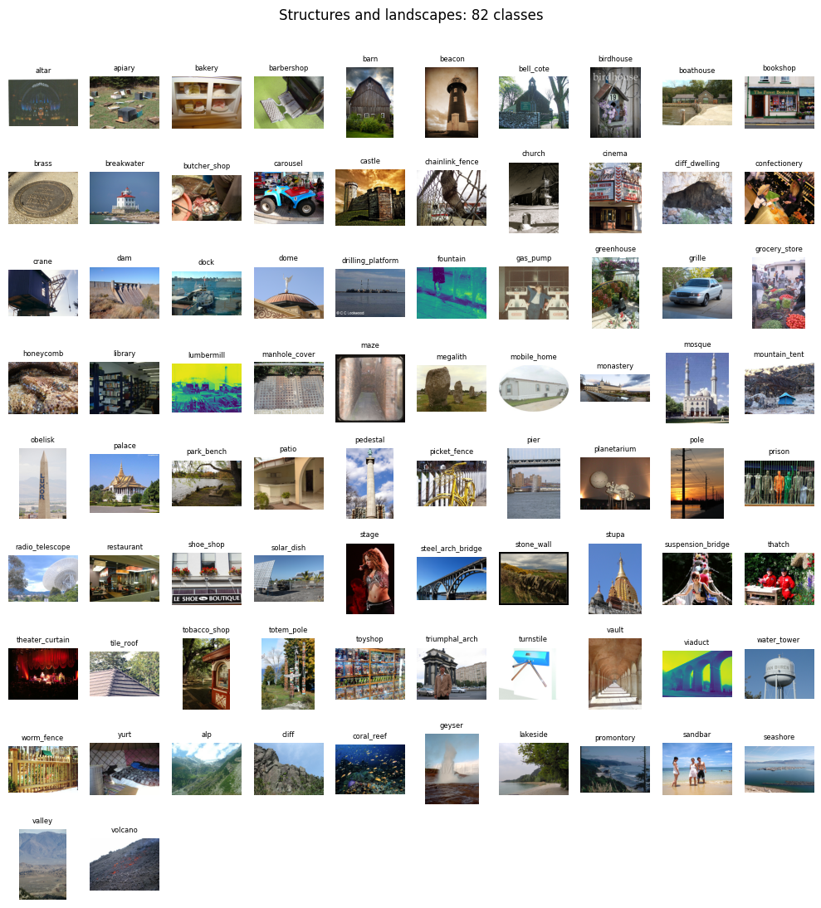
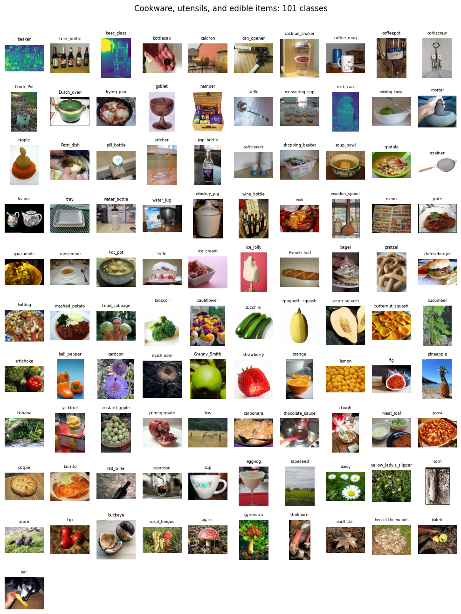
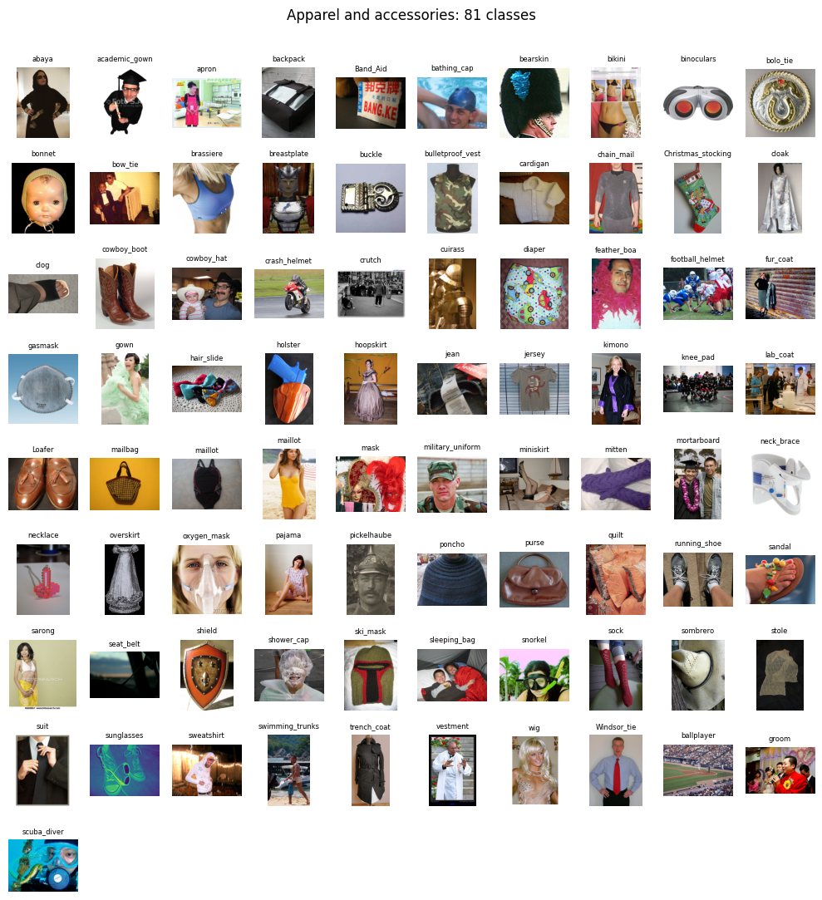

# ImageNet1k Coarse Classes
This repository organizes the ImageNet1k dataset into 10 coarse classes, where each class consists of semantically similar image categories.
The `imagenet_label_wordnet_synset_coarse_class.json` file contains information for all ImageNet1K classes, including their synset ID, label, URI, and coarse class.
The following outlines the coarse classes.

## Coarse class 0

## Coarse class 1

## Coarse class 2

## Coarse class 3

## Coarse class 4

## Coarse class 5

## Coarse class 6

## Coarse class 7

## Coarse class 8

## Coarse class 9

